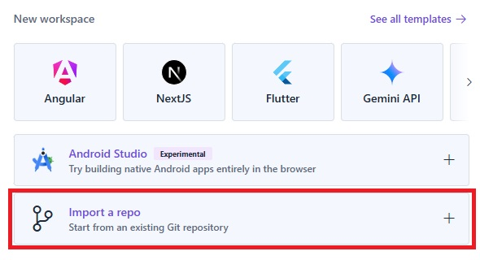
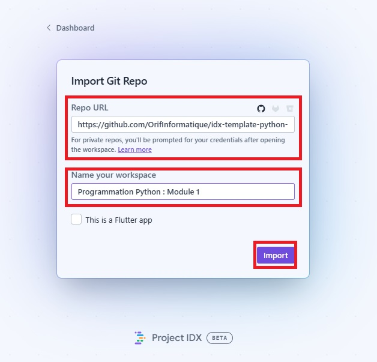
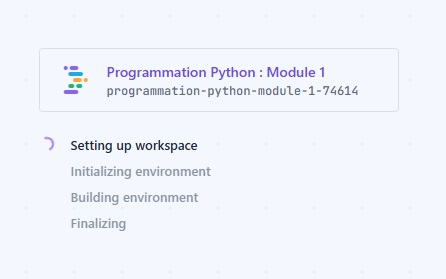
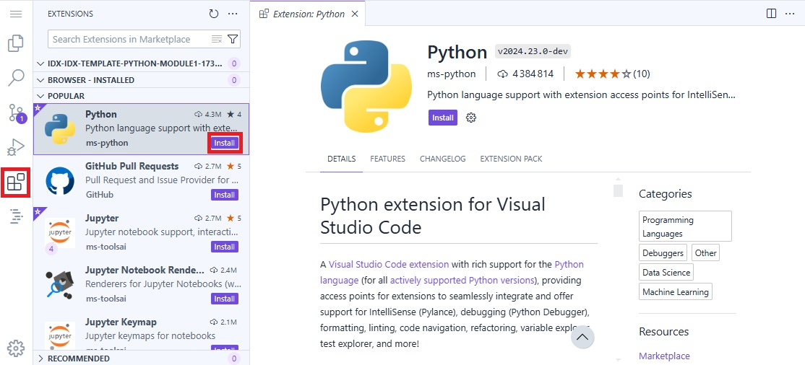
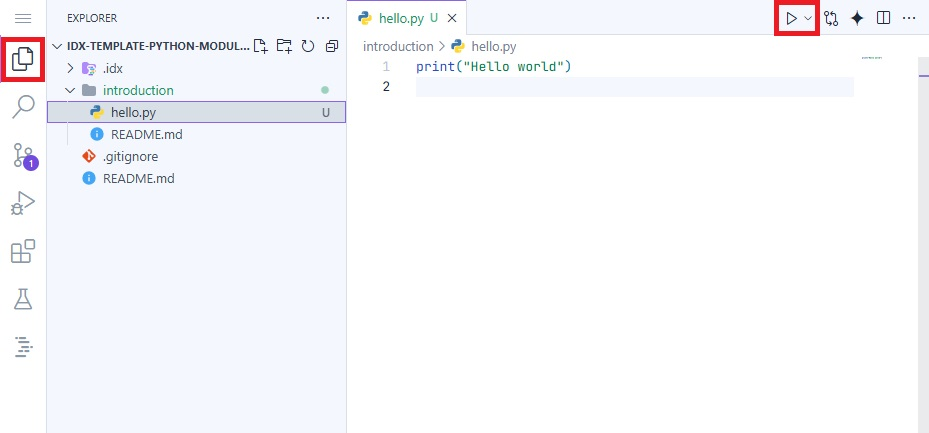
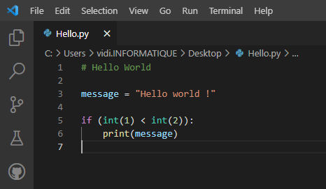
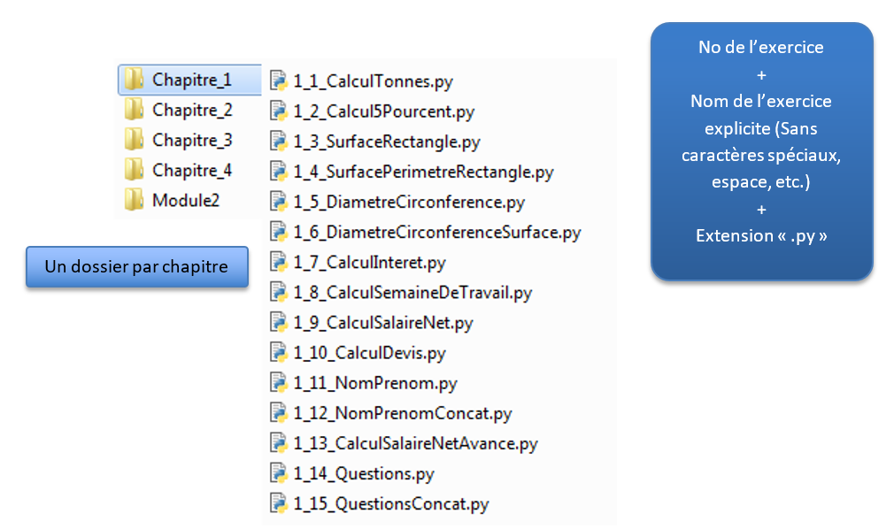
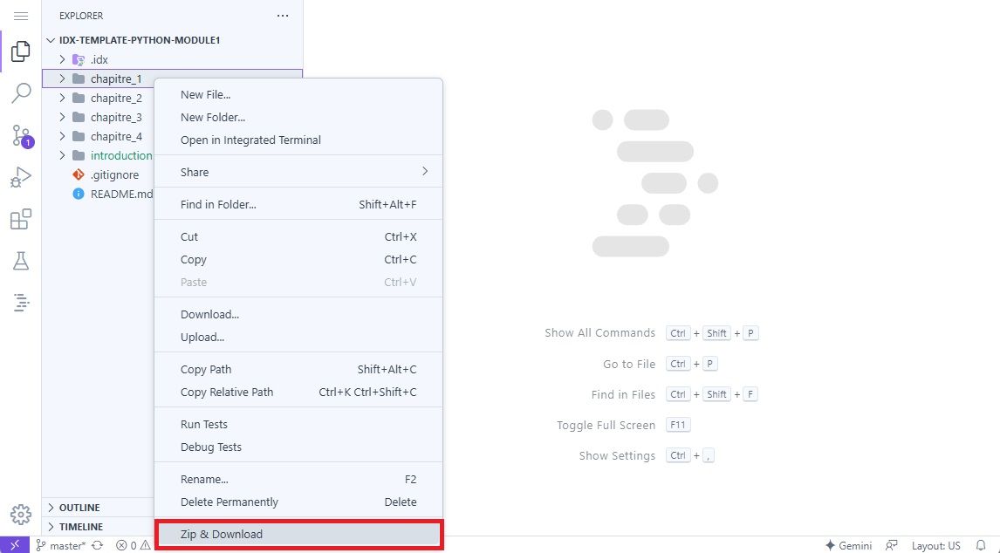

# Programmation Python : Module 1

## Introduction et mise en place de l’environnement distant

[Introduction](#introduction)

[Environnement distant](#environnement-distant)

[Installer l’extension “python”](#installer-l’extension-“python”)

[Notions élémentaires](#notions-élémentaires)

[Apprendre le Python avec ce module](#apprendre-le-python-avec-ce-module)

[Sauvegarder vos programmes](#sauvegarder-vos-programmes)

[Partager vos programmes](#partager-vos-programmes)

# Introduction {#introduction}

Le langage Python est un langage de programmation orienté objet, multi-paradigmes et multiplateformes. Il est l’un des plus utilisés aujourd’hui et il est très apprécié pour la formation.

Pour pouvoir écrire du code et que  votre ordinateur soit capable de comprendre le langage Python,  deux éléments sont essentiels : 

- Un **interpréteur Python**, indispensable pour l’exécution de notre futur code.  
- Un **environnement de développement (IDE)**. Quel que soit le langage de programmation que vous utilisez, vous devez disposer d’un [environnement de développement](https://fr.wikipedia.org/wiki/Environnement_de_d%C3%A9veloppement), par exemple Visual Studio Code.

# Environnement distant {#environnement-distant}

Google propose un environnement de développement distant (IDX) permettant de faire de la programmation depuis son navigateur. Pour cela, rendez-vous sur [https://idx.google.com/](https://idx.google.com/) . Un compte Google sera nécessaire pour accéder à l’environnement. 

Une fois connecté, vous pouvez créer un nouvel environnement de développement. IDX propose plusieurs templates pour démarrer facilement un projet. Pour cette introduction, nous allons utiliser un template propre à la section informatique de l’Orif. Pour cela, depuis la première section à droite, vous pouvez cliquer sur “**import a repo**”.

Un formulaire vous permettra de spécifier l’URL où se situe le template et le nom de votre environnement. Dans le cadre de ce module vous pouvez ajouter les informations suivante : 

- Repo URL : https://github.com/OrifInformatique/idx-template-python-module1  
- Name your workspace : Programmation Python : Module 1

Vous pouvez finalement cliquer sur “import” pour créer votre premier environnement. 

L’environnement peut prendre quelques minutes avant d’être créé. Vous verrez cet écran le temps que tout se mettent en place : 

Une fois l’environnement chargé, vous aurez accès à Visual Code Studio directement depuis votre navigateur via IDX. 

# Installer l’extension “python” {#installer-l’extension-“python”}

Depuis la navigation principale, vous pouvez vous rendre sur la page “extensions” (l'icône avec les 4 carrés). Depuis cette page, vous devriez trouver l'extension ***python***, publié par “ms-python”. Une fois trouvé, vous pouvez cliquer sur le bouton “install” lié à cette extension. 

Une fois installé, les extensions “***python***” et “***python debugger***” seront disponibles dans l’environnement. Vous pourrez retourner dans l’explorateur de fichiers (icône représentant deux feuilles de papier), et ouvrir le fichier “hello.py” présent dans le dossier “introduction”. Un triangle va alors apparaître au-dessus du fichier sur la droite de l’interface. En cliquant dessus, cela permet de lancer le script python ouvert. 

Une console devrait alors s’ouvrir et afficher les mots “Hello world”. 

# Notions élémentaires {#notions-élémentaires}

Les éditeurs de code appliquent une coloration syntaxique pour faciliter la lecture et la compréhension du code par les programmeurs. Dans Visual Studio Code, les couleurs par défaut sont :

Le violet pour les mots-clés (keywords)  
if, while, try, etc.

Le turquoise pour les types (classes)  
int, str, float, etc.

Le jaune pour les fonctions (méthodes)  
print, input, etc.

Le bleu pour les variables (attributs)  
maVariable

Le brun pour les textes (chaînes de caractères)  
″Hello world \!″

Le vert pour les commentaires  
\# Mon commentaire

Pour sauver votre programme, aller dans le menu « File/Save », ou « File/Save As… » pour faire une copie.

Pour exécuter votre programme, cliquer sur le triangle « play » ou aller dans le menu « Run » ou presser les touches « Shift \+ F5 ».

# Apprendre le Python avec ce module {#apprendre-le-python-avec-ce-module}

Au travers de ce module, vous apprenez le langage Python de manière autonome. Il est composé de 4 chapitres qui contiennent une partie théorique, quelques exemples et des exercices au niveau de difficulté évolutif.

| Chapitre 1 | [https://sectioninformatique.ch/python-module-1-1/](https://sectioninformatique.ch/python-module-1-1/) |
| :---- | :---- |
| **Chapitre 2** | [https://sectioninformatique.ch/python-module-1-2/](https://sectioninformatique.ch/python-module-1-2/) |
| **Chapitre 3** | [https://sectioninformatique.ch/python-module-1-3/](https://sectioninformatique.ch/python-module-1-3/) |
| **Chapitre 4** | [https://sectioninformatique.ch/python-module-1-4/](https://sectioninformatique.ch/python-module-1-4/) |

# Sauvegarder vos programmes {#sauvegarder-vos-programmes}

Dans votre dossier personnel, créez maintenant les dossiers pour les 4 chapitres du 1er module. A droite, observez la syntaxe des noms de fichiers. Ceux-ci sont conformes à nos règles de nommage des fichiers et des dossiers.

# Partager vos programmes {#partager-vos-programmes}

Pour partager vos programmes avec votre formateur, vous pouvez les compresser et les enregistrer sur votre machine locale. Pour cela il vous suffit de faire un clic droit sur le dossier du chapitre que vous avez terminé, puis de cliquer sur “Zip & download”. Vous aurez ainsi un fichier zip prêt à être envoyé. 

